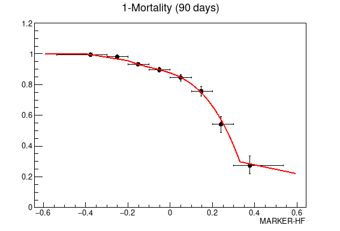
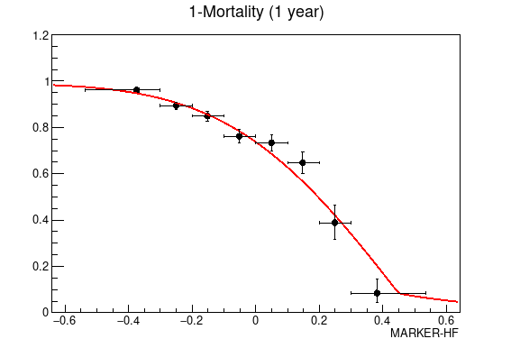

# MARKER-HF, heart failure risk score

Code to calculate MARKER-HF heart failure risk score from E. Adler et al, *Improving risk prediction in heart failure using machine learning* [Eur J Heart Fail. doi:10.1002/ejhf.2155 (2021)](https://doi.org/10.1002/ejhf.1628).

The calculation of MARKER-Hf is lso available through a [web calculator](https://marker-hf.ucsd.edu).

MARKER-HF is calculated based on the following eight covariates

- Diastolic pressure (mm Hg) [20-120]
- Creatinine (mg/dL) [0-25]
- Blood Urea Nitrogen (mg/dL) [0-160]
- Hemoglobin (g/dL) [g/dL) [2-20]
- White Blood Cell Count (1e3 μL) [0-40]
- Platelets (1e3 μL)  [0-1500]
- Albumin(g/dL) [0-6]
- Red Blood Cell Distribution Width (%) [10-30]

Code to calculate MARKER-HF and the one year or 90 days survival probabilities is available in either C++ or python.

